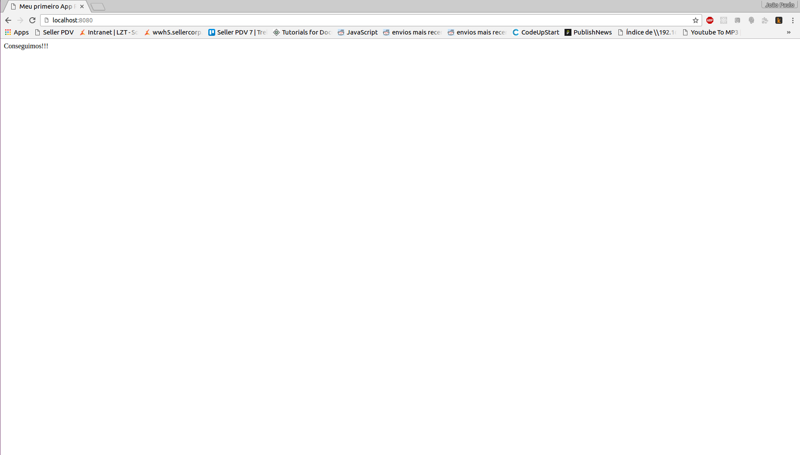

# 2 - E começa a jornada de um mestre Pokémon

Vamos começar analisando como é um código em React abaixo:

```js
import React from 'react';
class Pokemon extends React.Component {
	render() {
		return (
			<h1> Isso é um pokémon feito em React </h1>
		)
	}
}
```

Se você prestar atenção, as tags HTML estão dentro do código JavaScript. Isso que é o chamado JSX que falamos na introdução. O React nos deixa escrever código HTML junto com JavaScript. Porém, uma coisa importante a se saber é que esse código JSX será convertido para JS em um certo momento dentro da nossa aplicação.

Mas o que faz a conversão desse arquivo JSX para JS? Ele acontece automágicamente? Claro que não. A comunidade React em quase sua maioria adotou o **webpack** para esse serviço. 

### Mas o que é esse tal de webpack?

O webpack nada mais é que um empacotador de javascript entre outros. Ele é similar ao Gulp e o Grunt. Nós não faremos a configuração dele e nem explicarei como funciona. Deixarei abaixo o link para o download de um repositório inicial para o projeto e esse empacotador já vai estar configurado e pronto pra ser usado.

## E a jornada começa!

Primeiramente clone o [seguinte repositório](https://github.com/joaoeffting/react-initial)

1. Navegue até o repositório clonado.
2. Dentro dele digite 
```
npm install
npm install -g webpack
```
3. Agora vamos tentar executar nosso aplicativo:
```
Digite no terminal:
npm run dev

e depois acesso o browser na seguinte URL:  http://localhost:8080/

Se tudo der certo você terá uma tela parecida com essa no seu navegador:
```

