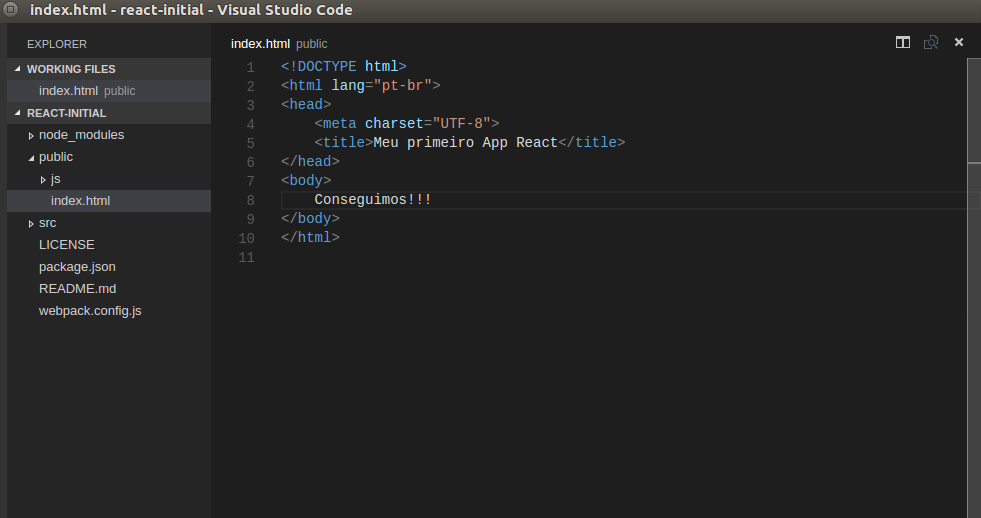
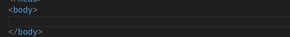
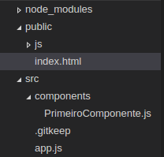

# 2 - E começa a jornada de um mestre Pokémon

Vamos começar analisando como é um código em React abaixo:

```js
import React from 'react';
class Pokemon extends React.Component {
	render() {
		return (
			<h1> Isso é um pokémon feito em React </h1>
		)
	}
}
```

Se você prestar atenção, as tags HTML estão dentro do código JavaScript. Isso que é o chamado JSX que falamos na introdução. O React nos deixa escrever código HTML junto com JavaScript. Porém, uma coisa importante a se saber é que esse código JSX será convertido para JS em um certo momento dentro da nossa aplicação.

Mas o que faz a conversão desse arquivo JSX para JS? Ele acontece automágicamente? Claro que não. A comunidade React em quase sua maioria adotou o **webpack** para esse serviço. 

### Mas o que é esse tal de webpack?

O webpack nada mais é que um empacotador de javascript entre outros. Ele é similar ao Gulp e o Grunt. Nós não faremos a configuração dele e nem explicarei como funciona. Deixarei abaixo o link para o download de um repositório inicial para o projeto e esse empacotador já vai estar configurado e pronto pra ser usado.

## E a jornada começa!

Primeiramente clone o [seguinte repositório](https://github.com/joaoeffting/react-initial)

1. Navegue até o repositório clonado.
2. Dentro dele digite 
```
npm install
npm install -g webpack
```

3. Agora vamos tentar executar nosso aplicativo:
```
Digite no terminal:
npm run dev

e depois acesso o browser na seguinte URL:  http://localhost:8080/

### Se tudo der certo você terá uma tela parecida com essa no seu navegador:


Mas se pararmos para ver não existe nada de React nesse nosso HTML certo? Corretíssimo. Então vamos fazer com que agora, tenha!

A primeira coisa a se fazer é apagar aquele "Conseguimos!!!" que está dentro do body em public/index.html :


 

Depois disso digite o seguinte dentro do body:

```js
  <div id="root"> </div>
```

É dentro dessa div que nosso componente vai ser renderizado.

Por fim, seu HTML deve ficar dessa forma:

```html
<!DOCTYPE html>
<html lang="pt-br">
<head>
	<meta charset="UTF-8">
	<title>Meu primeiro App React</title>
</head>
<body>
	<div id="root"> </div>
</body>
</html>
```
dentro da pasta **src** crie um arquivo chamado app.js

Dentro desse arquivo digite o seguinte código (a explicação vou deixar em forma de comentário dentro do fonte):

```js
//Aqui importamos o React e o ReactDOM
import React from 'react';
import ReactDOM from 'react-dom';

/*É pelo ReactDOM que fazemos a renderização do componente para dentro
do nosso HTML.
    Veja que o primeiro parâmetro é uma tag HTML e o segundo é para onde queremos
que essa tag seja renderizada
*/
ReactDOM.render(
    <h1> E nasce um mestre Pokémon </h1>,
    document.getElementById('root')
);
```

Ainda falta uma coisa! Volte para o index.html e importe esse arquivo da seguinte maneira, logo depois da tag </body>:
```html
<script src="/js/app.min.js"></script>
```
Ué, mas nós criamos o arquivo como app.js e ali importamos como app.min.js? Veja abaixo a explicação:
```
É aqui que aquele webpack trabalha. Ele está configurado para procurar um arquivo chamado app.js dentro da pasta src e minificá-lo como app.min.js dentro de public/js/
```

Agora execute novamente o npm run dev e execute localhost:8080. A mensagem aparece lá. Mas isso ainda não é bem um componente React. Vamos melhorar.

Dentro da pasta src crie uma outra pasta chamada components. Dentro de components crie o arquivo **PrimeiroComponente.js**
```
No React, quando criamos um componente adotamos como padrão iniciar o nome do arquivo com letra maiúscula.
```

sua estrutura deve ficar assim:



Agora abra o arquivo **PrimeiroComponente.js** e digite o seguinte código:
```js
//importamos novamente o React.
import React from 'react';

//Repare que agora não precisamos mais importar o ReactDOM

/*
Aqui utilizamos a estrutura de classes do ES6 e dizemos
que nosso componente, chamado de MestrePokemon extende de React.Component
*/
class MestrePokemon extends React.Component {
    //todo componente React precisa ter esse método render()
    render() {
        return (
            <h1> E nasce um mestre Pokémon!!!!!! </h1>
        )
    }
}

/*
Precisamos exportar nosso componente para que ele possa ser importado
em outros arquivos e utilizado.
*/
export default MestrePokemon;
```

Se formos para o navegador veremos que nada mudou. Ainda precisamos fazer algumas alterações. Volte para o arquivo **src/app.js**.

A primeira coisa que temos de fazer é importar nosso componente. Nossos imports ficarão assim:
```js
//Aqui importamos o React e o ReactDOM
import React from 'react';
import ReactDOM from 'react-dom';

//Importamos o componente MestrePokemon do arquivo PrimeiroComponente
import MestrePokemon from './components/PrimeiroComponente'
```

## QUASE LÁ

Agora tudo que precisamos fazer é alterar nosso ReactDOM.render. Veja abaixo:

```js
ReactDOM.render(
    <MestrePokemon />,
    document.getElementById('root')
);
```

#Prontinho. Criamos nosso primeiro componente React :D